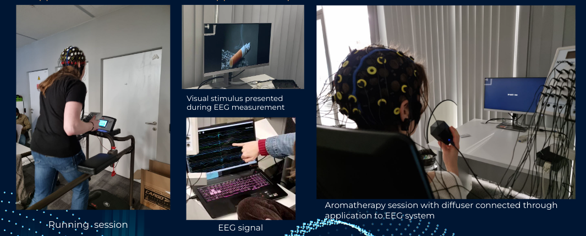

# QuitSmart

Companion diagnostic approach to understand effectiveness of therapy with 3 step procedural

    step1:Measure respond with EEG

    step2:Introduces the effective therapy for addiction

    step3:Measure the respons again and valdating it how much the treapy is helpfull

aroma_script:

    This script helps to comunicate the aroma diffiusser with the EEG instrument 

Motor Imagery:
    
    The script that written to show randomly show the smokiing and non smoking related picture

analysis.ipynb
   
     The script anlaysisng the recording of the data

Example of the output of anlaysis 
 
 