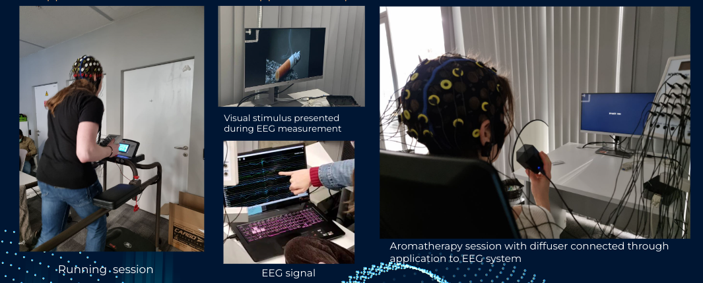

# QuitSmart

__Companion diagnostic approach to understand effectiveness of therapy with 3 step procedural

    __step1:Measure respond with EEG

    __step2:Introduces the effective therapy for addiction

    __step3:Measure the respons again and valdating it how much the treapy is helpfull

